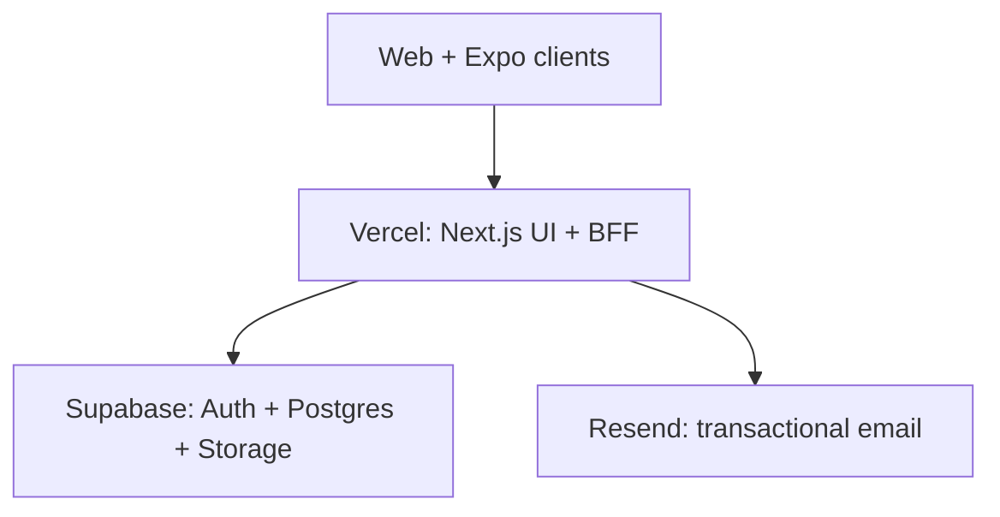

# SyndeoCare Platform

The Vercel-first SyndeoCare monorepo. It replaces the legacy AWS microservice
deployment with a smaller, auditable platform built around Next.js 16,
React 19, Supabase, Resend, and Expo.

## Architecture

- `apps/web` — Next.js App Router UI and versioned BFF API for web/mobile
- `supabase` — PostgreSQL migrations, Row Level Security, Auth, and Storage setup
- `packages/contracts` — shared Zod schemas and API contracts
- `apps/web/public/openapi.yaml` — mobile and partner API specification
- `docs` — architecture, security, and deployment runbooks



The browser receives only the Supabase URL and publishable key. The service-role
and Resend keys stay server-side. PostgreSQL Row Level Security remains the final
authorization boundary even when a UI or API check is missed.

## Local setup

1. Copy `.env.example` to `apps/web/.env.local` and add development-only credentials.
2. Install dependencies with `pnpm install`.
3. Apply migrations to a development Supabase project.
4. Run `pnpm dev`.

Useful checks:

```bash
pnpm lint
pnpm typecheck
pnpm test
pnpm build
pnpm test:e2e
```

Secrets belong in Supabase/Vercel environment settings, never in Git.

## Deployment

The first deployment is always a Vercel Preview. Production and the
`syndeocare.ai` domains are promoted only after migrations, authentication,
email, accessibility, and end-to-end tests pass.

In Vercel, set the project root to `apps/web`. Keep GitHub, Supabase, Resend,
and domain ownership under the SyndeoCare organization; the Vercel project is
the only resource owned by the designated deployment account.

See [deployment.md](docs/deployment.md) for the complete promotion checklist.
